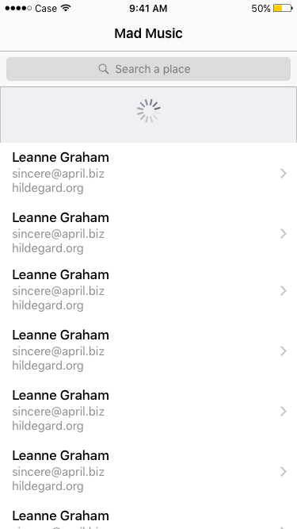
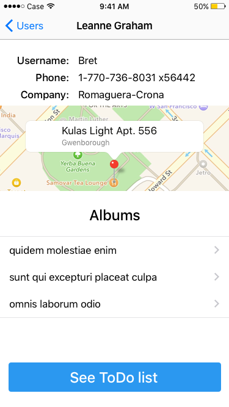
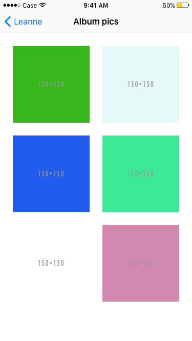
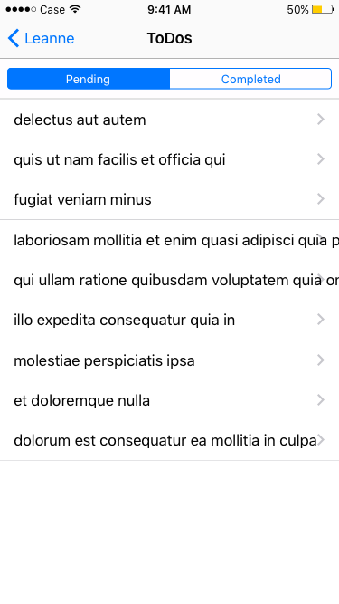

# Technical test for iOS

This test app consists of users and their albums and To-Do lists.

## Main screen

The first screen to show is a table of users, fetched from the “/users” resource of [JSONPlaceholder](https://jsonplaceholder.typicode.com).

### Points of value:
- Save all fetched data to Core Data.
- Pull to refresh the table.
- Search a Map location or place and filter users within the same units of lat/long. //TODO: example

## User screen

This screen shows the details of an user, a map of its address, a table of his albums (fetched from the “/albums” resource of [JSONPlaceholder](https://jsonplaceholder.typicode.com)), and a button to see his To-Do list.

## Album pics screen

This screen shows a collection view of an album's photos', fetched from the “/photos” resource of [JSONPlaceholder](https://jsonplaceholder.typicode.com).

## To-Do screen

This screen shows a table of an user's To-Do list, fetched from the “/todos” resource of [JSONPlaceholder](https://jsonplaceholder.typicode.com). Additionally, there is a selector to filter completed/not-completed To-Dos.

